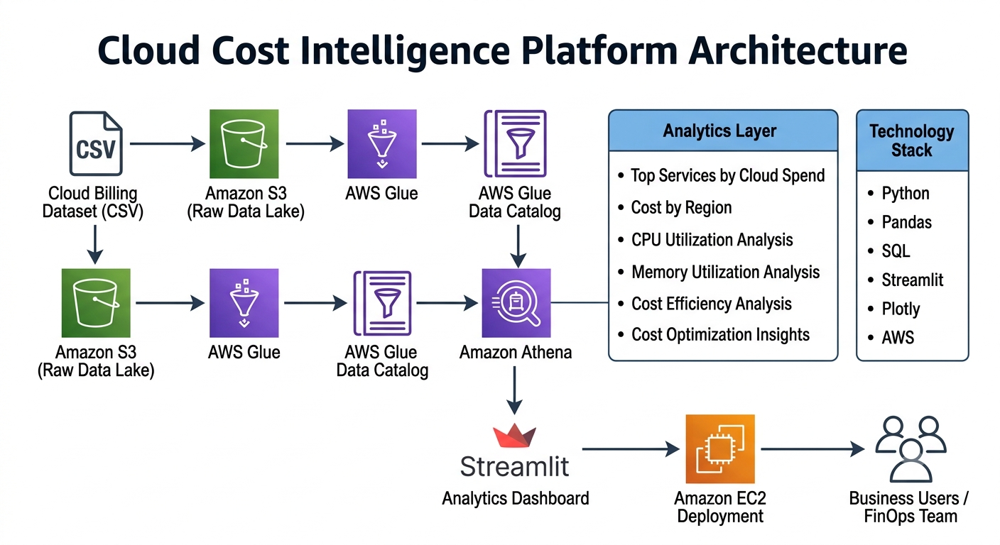
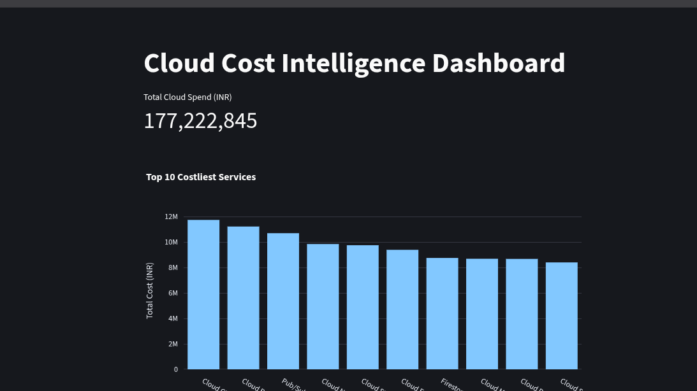
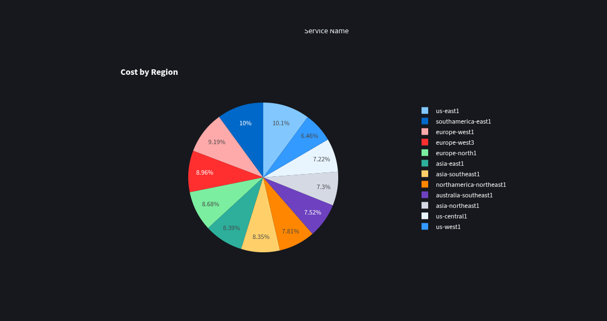
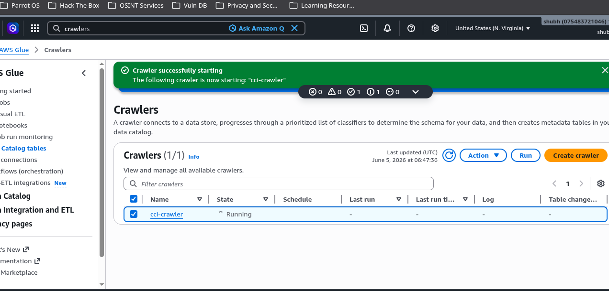
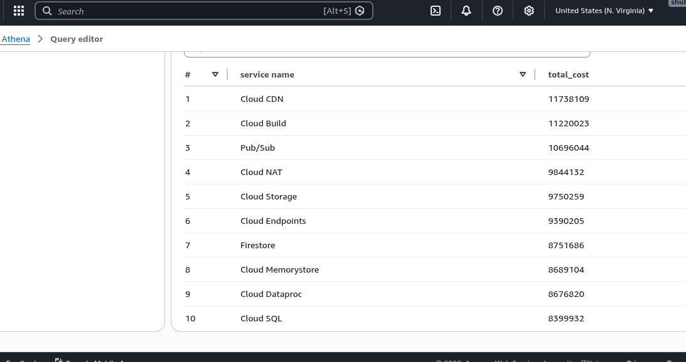
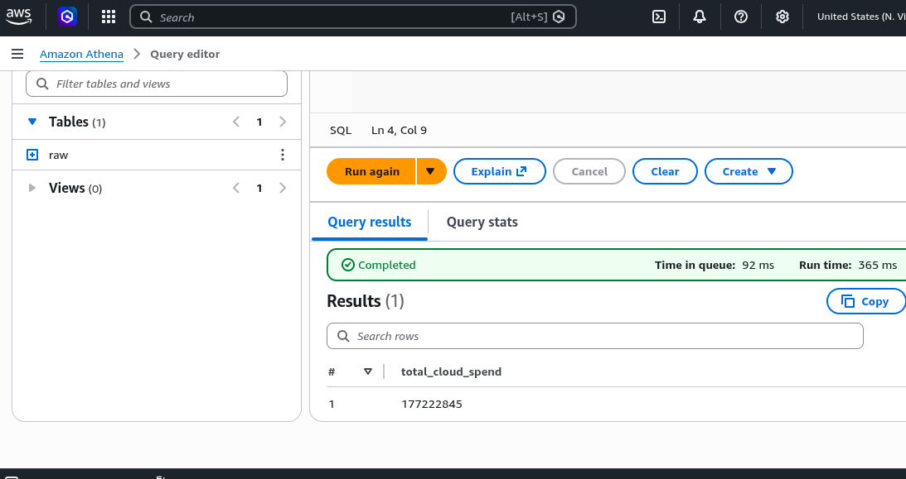
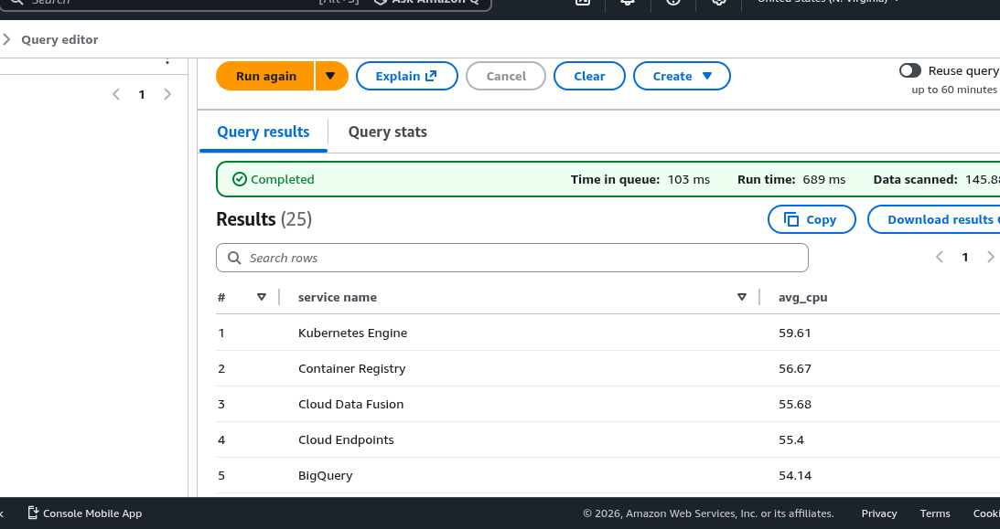

# Cloud Cost Intelligence Platform

Hi, I'm **Shubham Thakur**, 

I built this project to understand how cloud billing data can be transformed into meaningful business insights using AWS services. The idea was to simulate a real-world cloud cost analytics workflow—from storing data in Amazon S3 and cataloging it with AWS Glue to querying it with Athena and visualizing insights through a Streamlit dashboard.

Through this project, I gained hands-on experience with AWS Glue Crawlers, Athena, EC2 deployment, IAM configuration, and dashboard development. The platform helps analyze cloud spending patterns, resource utilization, and potential cost optimization opportunities in an interactive way.

This repository contains the complete workflow, architecture, dashboard, and deployment setup used in the project.

---

## Architecture

The platform ingests cloud billing data, catalogs metadata using AWS Glue, performs analytics through Athena, and visualizes insights through a Streamlit dashboard deployed on EC2.

---

## Dashboard Overview

The dashboard provides cloud spend visibility, utilization monitoring, and cost efficiency insights.

---

## Data Pipeline

Billing data is stored in Amazon S3 and automatically cataloged using AWS Glue Crawlers. The generated metadata is queried through Amazon Athena.

---

## Cost Analytics

The dashboard identifies the highest spending cloud services and helps understand where cloud budgets are being consumed.

---

## Resource Utilization Analysis

CPU and memory utilization metrics are analyzed alongside cost data to identify inefficient resource usage.

---

## Deployment

The Streamlit dashboard was deployed on an AWS EC2 instance and exposed publicly through EC2 Security Group configuration.

---

## Tech Stack

**Cloud Services**

* Amazon S3
* AWS Glue Crawler
* AWS Glue Data Catalog
* Amazon Athena
* Amazon EC2
* AWS IAM

**Analytics**

* Python
* Pandas
* SQL

**Visualization**

* Streamlit
* Plotly

---

## Future Improvements

* Automated ETL using AWS Glue Jobs
* Cost anomaly detection
* Real-time spend monitoring
* Multi-cloud cost analytics
